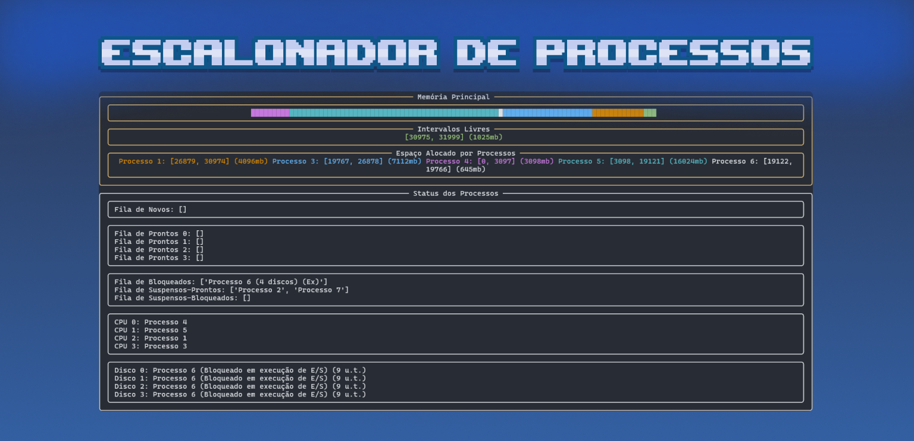

# Escalonador de Processos

### Equipe:

<table>
  <tr>
    <td align="center">
      <a href="#">
         
        
          <b>João Marinho</b>
        
      </a>
    </td>
  <td align="center"> 
      <a href="#">
         
        
          <b>Maurício Pollis</b>
        
      </a>
    </td>
    <td align="center">
      <a href="#">
         
        
          <b>Rafael Amparo</b>
        
      </a>
    </td>
    <td align="center">
      <a href="#">
         
        
          <b>Thales Abranches</b>
        
      </a>
    </td>
        <td align="center">
      <a href="#">
         
        
          <b>Vinícius Mouzinho</b>
        
      </a>
    </td>
  </tr>
</table>

Para executar o nosso simulador de escalonamento de processos, primeiro digite o comando `pip install -r requirements.txt` no seu terminal para conseguir visualizar as tabelas de escalonamento e informações durante a execução! Depois, digite  `python .\main.py` para executar o programa no seu terminal.

São fornecidos três arquivos de entrada, para cobrir os mais diversos tipos de situações que podem ocorrer na rotina do escalonador. Para trocar o arquivo, acesse, na `main.py`, a variável `caminho_arquivo` nas inicializações do programa (linha 16) para um dos seguintes arquivos: `entrada.txt` (arquivo padrão), `entrada_1.txt`, `entrada_2.txt` ou `entrada_3.txt`.

O escalonador simulado é implementado de acordo com uma política preemptiva feedback, com quantum de 3 unidades de clock e 4 filas de prontos - filas 0, 1, 2 e 3. A máquina simulada dispõe de 4 CPUs, 4 discos, para operações de acesso à memória, e 32GB de memória principal, assegurando que cada recurso solicitado está apenas disponível para o processo requisitante durante toda a sua execução.

Ao desenvolver o projeto, algumas decisões de implementação foram tomadas para tentar simular diversos impasses que podem ocorrer na rotina do escalonamento e analisar possíveis rumos para resolver tais questões. Um exemplo é a política de suspensão:

- Decidimos que apenas processos bloqueados presentes na MP poderiam ser suspensos, e só se seguissem as seguintes características:
  - Seu tempo de operação de E/S é maior ou igual a 10 u.t;
  - No momento em que possa ser suspenso, não pode ter executado mais da metade do seu tempo de disco.
- A suspensão de um processo bloqueado também só ocorre para dar espaço a processos novos ou suspensos-prontos.
- Outra decisão de projeto tomada foi quanto ao desempate: quando há disputa de recursos entre processos, a prioridade é dada sempre àqueles que possuem menor tempo de execução.
- Para evitar possíveis deadlocks no acesso ao disco, é garantido ao processo bloqueado o número de discos que ele precisa caso disponível - se não houver discos suficientes, ele permanece bloqueado até conseguir o acesso.
- A memória principal simulada do programa segue uma implementação de particionamento dinâmico com alocação seguindo a política best fit, que encontra o ‘melhor’ espaço possível para encaixar um processo.

Ao fim do escalonamento, a interface gráfica mostra uma tabela de resumo do acesso dos processos à CPU e o cálculo de tempo normalizado de cada processo despachado.

O projeto segue o padrão de Programação Orientada a Objetos, com a definição das classes:

- `Processo` (responsável pelas instâncias de processos)
- `CPU` (representando as unidades de processamento)
- `Disk` (representando as unidades de disco para operações de acesso à memória)
- `leitorArquivo` (para leitura do arquivo de entrada)
- `Dispatcher` (para organização dos processos em suas respectivas filas)
- `Memory` (para gerenciamento da simulação de memória)
- `Traceback` (para configuração da interface gráfica)
- `Calculadora` (para cálculo de tempo normalizado)

As configurações de simulação são altamente customizáveis: na inicialização, para testar outros cenários, pode-se alterar o número de CPUs, número de discos, tamanho da memória, quantidade de filas de prontos, arquivo de entrada, etc. Por exemplo, se configurar os valores de:

- quantum: 2;
- número de CPUs: 1;
- discos: 4;
- quantidade de filas de prontos: 3;
- arquivo de entrada: entrada_3.txt;

pode ser verificada a solução de um escalonamento feito em aula!
